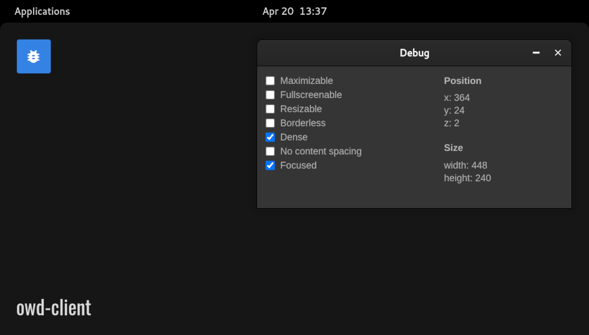

<p align="center">
  
</p>

# Debug App

> Debug app for your Open Web Desktop client

## Overview

The OWD Debug App is a test module for Open Web Desktop that displays useful info about windows.

## Quick Installation


1.  Navigate to your OWD client folder in your terminal:

    ```bash
    cd owd-client
    ```

2.  Install the module using npm or yarn:

    ```bash
    npm install github:owdproject/app-debug
    ```

3.  Register the application in your OWD configuration file:

    ```typescript
    // owd.config.ts
    import AppDebug from 'owd-app-debug/owd.config'
    
    export const owdConfig = {
        theme: ['github:owdproject/theme-win95', { install: true }],
    
        apps: [
           './node_modules/owd-app-debug',
        ],
    
        loader: async () => {
            await defineDesktopApp(AppDebug)
        }
    }
    ```

## Compatibility

This application is compatible with Open Web Desktop client version `3.0.0-alpha.0`.

## License

This project is released under the [MIT License](LICENSE).