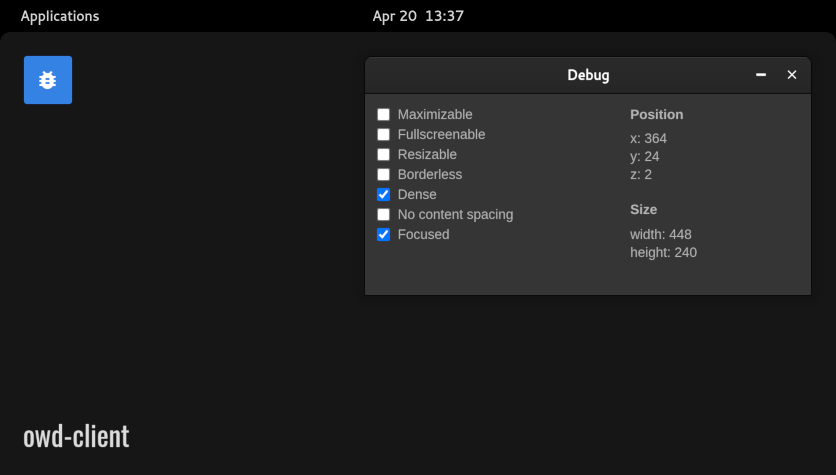

# Debug module for OWD Client
> Debug app for your Open Web Desktop client

<p>
    
</p>

<p>
    <a href="https://github.com/owdproject/owd-client"></a>
    <a href="https://github.com/topics/owd-modules"></a>
    <a href="https://discord.com/invite/3KFVP8b"></a>
    <a href="https://patreon.com/hacklover"></a>
</p>

## Overview
A module to test out OWD and see how windows work

## Quick install
- Move to your client folder, then
  ```
  # Install this module with Npm
  npm install https://github.com/owdproject/owd-app-debug
  
  # Or using Yarn
  yarn add https://github.com/owdproject/owd-app-debug
  ```
- Define this module in `owd-client/client.extensions.ts`
  ```js
  import DebugModule from "owd-app-debug";

  export default {
    modules: {
      app: [
        DebugModule,
      ]
    },
    ...
  ```

## Compatibility
- Open Web Desktop client v2.0.0-beta.4

## License
This project is released under the [MIT License](LICENSE)